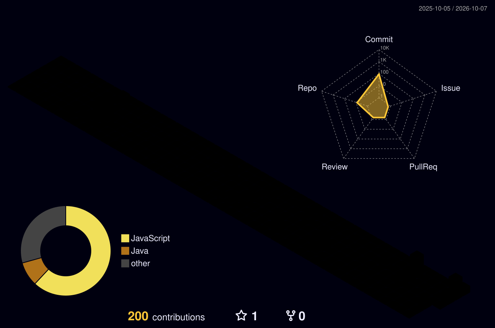

# Guilherme Otávio Xavier de Souza
### Engenharia de Computação & Desenvolvimento de Software

 

> *"Construindo soluções robustas desde sistemas de baixo nível até aplicações completas para web."*

---

###  Sobre Mim

- 🎓 Graduando em **Engenharia de Computação** pela Pontifícia Universidade Católica de Goiás (PUC Goiás).
- 💼 Experiência prática com automação de sistemas, modelagem de dados e desenvolvimento de software.
- ⚙️ Foco técnico em **Desenvolvimento Backend, Arquitetura de Software e Otimização de Bancos de Dados**.
- 🛠️ Trabalho rotineiramente com soluções envolvendo linguagens de sistemas (**C**), ecossistemas corporativos (**Java**) e o universo web (**Node.js/JavaScript**).

---

### 💻 Stack Tecnológica & Ferramentas

<table>
  <tr>
    <td width="25%" valign="top">
      <h4>Linguagens</h4>
       
       
       
       
      
    </td>
    <td width="25%" valign="top">
      <h4>Backend & Servidores</h4>
       
       
      
    </td>
    <td width="25%" valign="top">
      <h4>Bancos de Dados</h4>
       
       
      
    </td>
    <td width="25%" valign="top">
      <h4>Deploy & Ferramentas</h4>
       
       
       
      
    </td>
  </tr>
</table>

---

###  Projetos em Destaque

| Projeto | Descrição / Destaques Técnicos | Tecnologias | Links |
|:---|:---|:---:|:---:|
| **Sistema & Catálogo Comercial** | Plataforma de catálogo dinâmico de produtos com cálculo automático de pedidos e integração de checkout direto para WhatsApp. | `JavaScript` `HTML5/CSS3` `Netlify` | [Repositório](#) • [Live Demo](#) |
| **Discord Bot & Gamificação** | Aplicação backend para automação de servidores, contendo mecânicas de economia virtual, crafting de itens e inventário persistente. | `Node.js` `MongoDB` `Discord.js` | [Repositório](#) |
| **Sistemas & Algoritmos de Engenharia** | Implementação de estruturas de dados avançadas, rotinas de cálculo numérico e análise de concorrência em C. | `C` `Make` `GCC` | [Repositório](#) |

---

### 📊 Métricas & Estatísticas de Engenharia

  
  

 

  <h4>Visualização Tridimensional de Contribuições</h4>
  

---

### 🕹️ Histórico Interativo de Commits

  <picture>
    <source media="(prefers-color-scheme: dark)" srcset="https://raw.githubusercontent.com/Guilherme-OXS/Guilherme-OXS/output/github-contribution-grid-snake-dark.svg" />
    <source media="(prefers-color-scheme: light)" srcset="https://raw.githubusercontent.com/Guilherme-OXS/Guilherme-OXS/output/github-contribution-grid-snake.svg" />
    
  </picture>

 

  Atualizado automaticamente via GitHub Actions • Goiânia - GO

